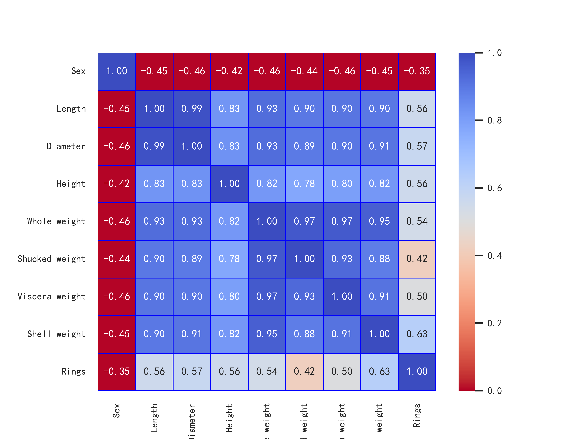
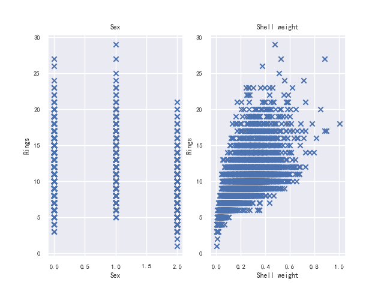
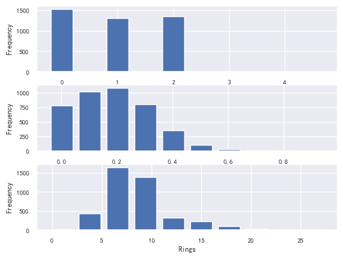
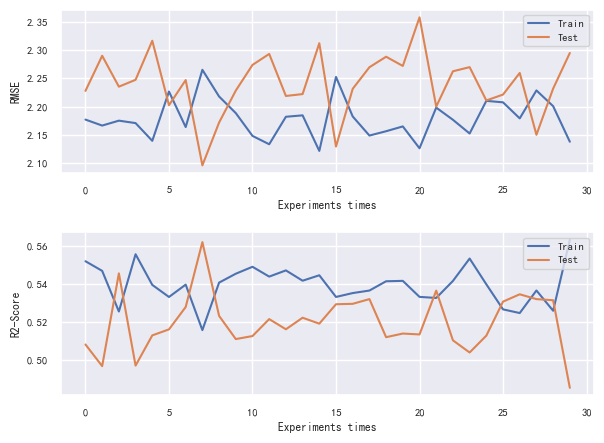
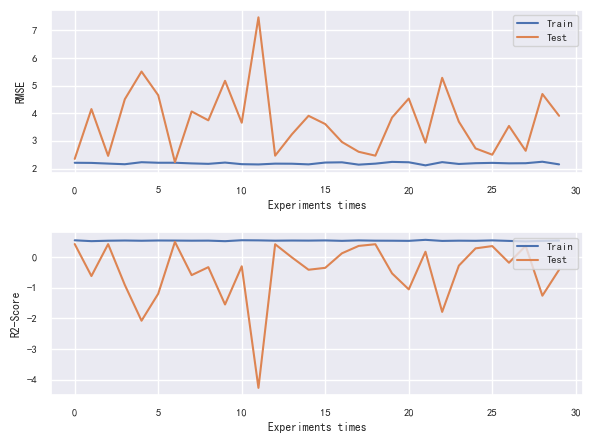
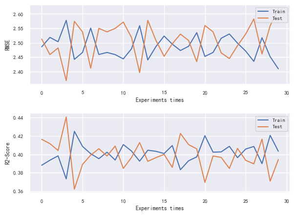
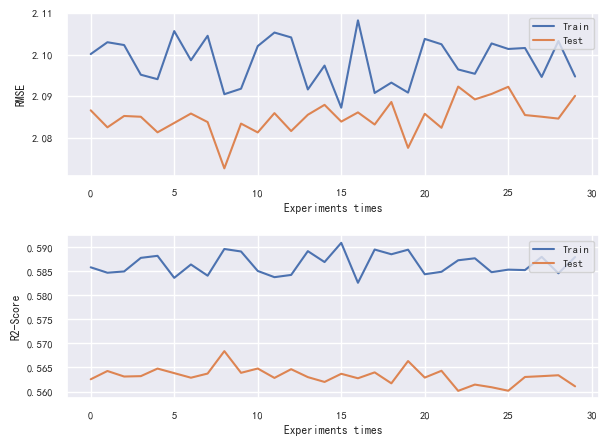
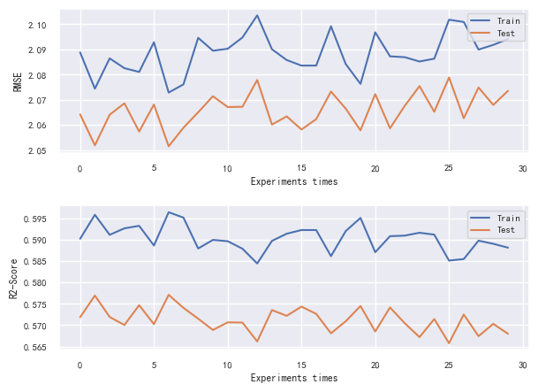

# Assessment 2: Option I Report
## Data processing

### Q1. Clean the data (eg. convert M and F to 0 and 1). You can do this with code or simple find and replace (5 Marks).
The data clean code is shown as following:
```python
# Read data
data_path = "E:\\Projects\\math5836\\Assessment2\\abalone\\abalone.data"
abalone = pd.read_csv(data_path)
abalone.columns = ['Sex','Length','Diameter','Height','Whole weight','Shucked weight','Viscera weight','Shell weight','Rings']
# Data processing: Convert M and F to 0 and 1
abalone['Sex'] = abalone['Sex'].map({'M': 0, 'F': 1,"I":2})
```

### Q2. Develop a correlation map using a heatmap and discuss major observations (5 Marks).

The correlation map of abalone is as in figure1

As showning figure1, Shell weight is the most positive correlated feature and Sex is the most negative correlated feature. Except Sex all the other feature is positive correlated feature. 

### Q3. Pick two of the most correlated features (negative and positive) and create a scatter plot with ring-age. Discuss major observations (10 Marks).
The two most correlated features are Sex and shell weight, the scalter of these features are presented in figure 2:

As shown in figure 2, the kind of Sex are negative correlated to Rings. The shell weight are positive correlated to the rings.

### Q4. Create histograms of the two most correlated features, and the ring-age. What are the major observations? (5 Marks)
The hisogram of Sex, Shell weight and the ring-age are shown in the image:

As we can observe from the image that the shell weight concentrated between 0.1 and 0.3. The numbers of the three gender categories are basically balanced. The rings are concentrated between 4 to 10. 
### Q5. Create a 60/40 train/test split - which takes a random seed based on the experiment number to create a new dataset for every experiment (5 Marks).
We can use the flowing code to split the data into train and test set. The function of train_test_split are included in scikit-learn library.
```python
X = abalone[['Sex' ,'Length','Diameter','Height','Whole weight','Shucked weight','Viscera weight','Shell weight']]
Y = abalone['Rings']
X_train, X_test, Y_train, Y_test = train_test_split(X, Y, test_size = 0.4, random_state=5)
```
## Modelling

### Q1 Develop a linear regression model using all features for ring-age using 60 percent of data picked randomly for training and remaining for testing. Visualise your model prediction using appropriate plots. Report the RMSE and R-squared score.
In this experiment, we random picked 60 percent of data for training and run experiments. The results of this model on train and test dataset are shown in the following figure:

The result of r2 and RMSE on train:
|Metrics|  mean   | std  |
|---|  ----  | ----  |
|RMSE| 2.18  | 0.032 |
|R2-score| 0.53  | 0.008 |

The result of r2 and RMSE on test:
|Metrics|  mean   | std  |
|---|  ----  | ----  |
|RMSE| 2.23 |0.055 |
|R2-score| 0.52  |0.01 |
### Q2 Compare linear regression model with all features, i) without normalising input data (taken  from Step 1), ii) with normalising input data.
In this experiment, we random picked 60 percent of data for training and run experiments. All the feature are normalised. The results of this model on train and test dataset are shown in the following figure:

### Q3 Develop a linear regression model with two selected input features from the data processing step.
In this experiment, we use the two selected features to train the model. The results of this model on train and test dataset are shown in the following figure:

### Q4 Compare the best approach from the above investigations using a neural network trained with SGD. You need to run some trial experiments to determine optimal hyperparameters, i.e number of hidden neurons and layers and learning rate etc. You can discuss your results and major observations about trial experiments.
In this experiment, I run the neural network with different hyperparameters, the first figure presentd the neural netwok with hide layer (200,30), max_iter=2000, the second figure presented neural network with hide layer (100,15), max_iter=1000. We can see that the first model achieve a better perforamnce. That indicates improving the architecture will achieve a better model. 



### Q5 Discuss the neural network with the linear regression model results. Discuss how you can improve model further.
A neural network is used to generate features or representations from the input data, and these features are then fed into a linear regression model for prediction. This can be particularly useful when dealing with complex, high-dimensional data where a linear regression model alone may not capture the underlying patterns effectively. In this experiment, a neural network with more hiden layers that can improve the performance of the network. The linear regression model achieve poor results than neural network. However, the accuracy of the both model is not statisfactory.  To improve the performance of the combined neural network and linear regression model, you can consider the following strategies:

+ Neural Network: Experiment with different neural network architectures, including the number of layers, the number of neurons per layer, and activation functions. Deeper networks with more neurons may capture more complex features.
+ Linear Regression: For the linear regression part, consider using more advanced linear regression techniques, such as ridge regression or LASSO regression, which can help prevent overfitting and improve generalization.
Feature Engineering:

+ Analyze the features extracted by the neural network. You may find that some features are more informative than others. Feature selection or engineering can help improve the quality of the input features for the linear regression model.
Regularization:

+ Apply regularization techniques to both the neural network and the linear regression model. Regularization methods like L1 and L2 regularization can help prevent overfitting and improve model generalization.
Hyperparameter Tuning:

+ Optimize hyperparameters for both the neural network and linear regression components. This includes learning rates, batch sizes, regularization strengths, and any other relevant hyperparameters.