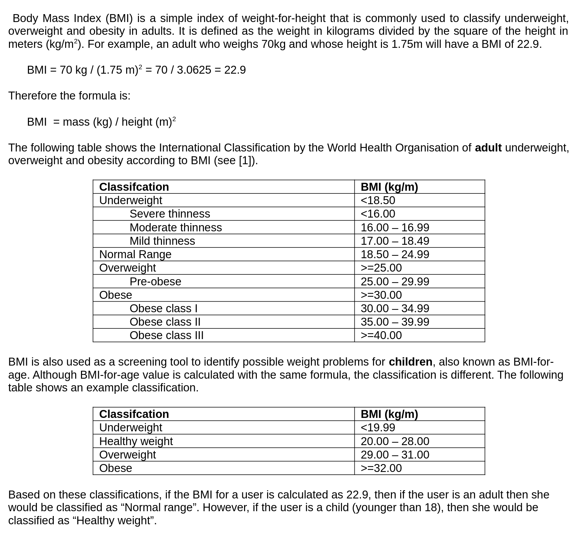

## Body Mass Index (BMI)

Develop a Python or R program to calcualte BMI. Your program first needs to collect some information about the user and then calculate BMI. 

* Date of birth (you can decide about the format of the date);

* Your program should allow the user to enter their height either in meters, inches and feet. The user should be asked to specify whether they are entering their height in meters, or in inches and feet. If the user chooses to enter their height in inches and feet then your program has to make the appropriate conversion to meters. For example, the user can enter their height in meters, for example 1.70 m, or the user can enter the height as inch or feet, for example 5 feet 7 inches, so you need to make the appropriate conversion. Remember 1 inch = 0.0254 meters and 1 foot = 0.3048 meters;

* Weight in kg, for example 53 kg;

* Your program should then display the BMI value and also should show how the user would be classified by WHO (e.g., overweight). If the user is adult or a child (younger than 18) then make sure that you use the correct classification;

* Your program should continue to run and calculate BMI as many times as the user would like, and the program should exit when the user explicitly specifies so.

